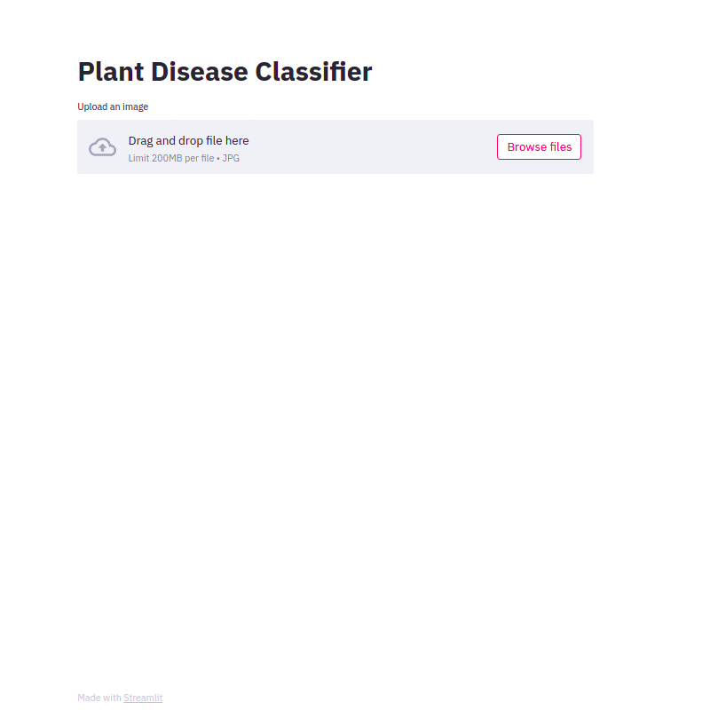

# Streamlit App for Plant Disease Classification

## Description

This is a simple app project built with [streamlit](https://streamlit.io/) for plant disease classification. In this work, I used a subset of the [PlantVillage dataset](https://www.kaggle.com/emmarex/plantdisease) containing 8 classes (diseases + healthy) of two crops (apple and grape). I used the PyTorch's MobileNetv2 implementation for the classification task. 



The code is organized as follows:

```./model/```: this directory contains the code used for training and evaluating the MobileNetv2.

```./weights/```: this directory contains the trained MobileNetv2 weights.

```./app.py```: this file contains the streamlit app code.

`./imgs/`: this directory contains some sample images for testing.

## Installation and Execution

All the code used Python 3. To install the dependencies you only need to run: 

 `pip install -r requirements.txt`

After installing the dependencies, you only need to run:

`streamlit run app.py`


